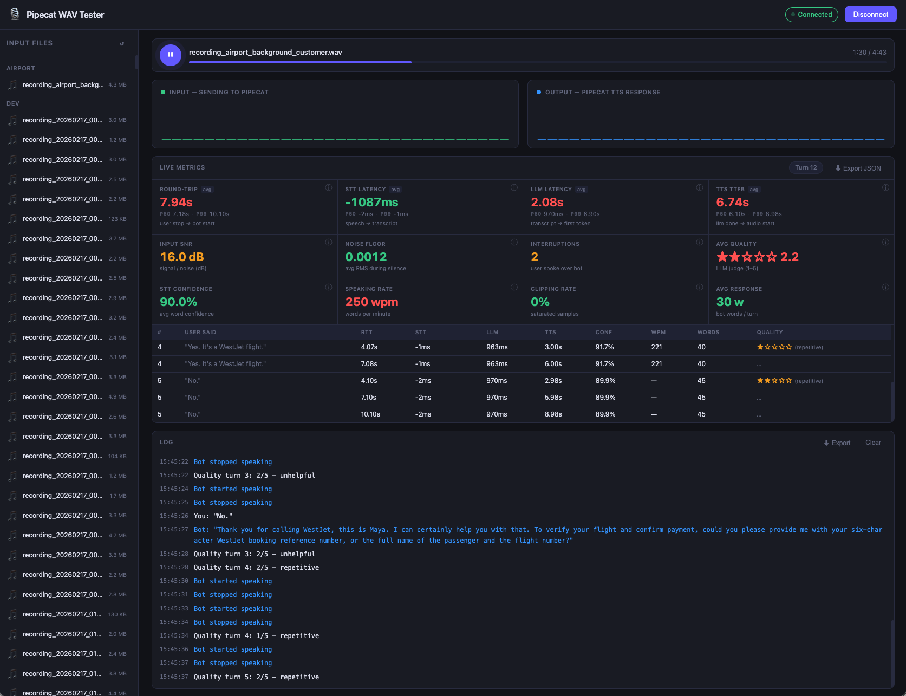

# Pipecat WAV Tester

A browser-based tool for testing Pipecat voice pipelines using pre-recorded WAV files instead of a live microphone. Simulates a two-way voice conversation by letting you play/pause audio at natural turn boundaries.



## What it does

- Lists all WAV files from a local `input/` directory in a sidebar
- Streams the selected file to a Pipecat STT → LLM → TTS pipeline over WebSocket
- You hear the WAV playing in your browser as it streams
- Press **Space** to pause — sends silence to trigger Pipecat's VAD end-of-speech detection, which kicks off STT → LLM → TTS
- You hear the TTS response audio in your browser
- Press **Space** again to resume WAV playback and continue the conversation
- Full conversation transcript shown as a chat panel (user and bot bubbles)
- Audio visualizers for both input and output

The bot persona is a WestJet customer care agent (Maya) that dynamically mocks realistic airline scenarios — flight status, booking lookup, rebooking, baggage, refunds, etc.

## Setup

### Prerequisites

- Python 3.11+
- [uv](https://docs.astral.sh/uv/)
- API keys for Deepgram, Google Gemini, and Cartesia

### 1. Create virtual environment

```bash
cd examples/wav-tester
uv venv --python 3.11
source .venv/bin/activate
```

### 2. Install dependencies

```bash
uv pip install -e "../../[websocket,deepgram,cartesia,silero]"
uv pip install fastapi "uvicorn[standard]" python-dotenv aiofiles \
               google-genai google-cloud-speech google-cloud-texttospeech
```

### 3. Configure API keys

```bash
cp .env.example .env
# Edit .env and fill in your keys
```

`.env` format:

```
DEEPGRAM_API_KEY=your_deepgram_key
GEMINI_API_KEY=your_gemini_key
CARTESIA_API_KEY=your_cartesia_key

# Optional: path to WAV files directory (default: input/)
# INPUT_DIR=input
```

### 4. Add WAV files

Put `.wav` files (any sample rate, mono or stereo) in the `input/` directory. Subdirectories are supported and shown as groups in the sidebar. Symlinks are followed.

```
input/
  recordings/
    call_001.wav
    call_002.wav
  other_samples.wav
```

### 5. Run

```bash
source .venv/bin/activate
uvicorn bot:app --host 0.0.0.0 --port 7860 --reload
```

Open **http://localhost:7860** in your browser.

## Usage

1. Click **Connect** — Maya greets you immediately with a WestJet opening line
2. Select a WAV file from the sidebar — it loads and resamples to 16 kHz
3. Press **Space** (or click ▶) to start playback — you hear the audio and it streams to Pipecat
4. Press **Space** to pause at the end of a caller's utterance — Pipecat processes it and Maya responds via TTS
5. Press **Space** to resume — continue through the rest of the file
6. Watch the conversation panel for transcriptions and Maya's responses

## Architecture

```
Browser                              Server (bot.py)
──────────────────────────────────   ─────────────────────────────────────────
WAV file → 16 kHz Float32           FastAPIWebsocketTransport
  → 10 ms Int16 chunks  ──────────►   RawAudioSerializer.deserialize()
  (also played locally               InputAudioRawFrame
   via monitorCtx)                     │
                                       ▼
                                     DeepgramSTTService  (STT)
                                       │ TranscriptionFrame
                                       ▼
                                     StatusNotifier  ──► transcription event
                                       │                 user_speaking event
                                       ▼
                                     LLMUserAggregator
                                       │ LLMMessagesFrame (on turn end)
                                       ▼
                                     GoogleLLMService  (Gemini 2.5 Flash)
                                       │ TextFrame stream
                                       ▼
                                     BotTextNotifier  ──► bot_text event
                                       │ (full response text)
                                       ▼
                                     CartesiaTTSService  (TTS)
                                       │ OutputAudioRawFrame
                                       ▼
                                     FastAPIWebsocketOutputTransport
  ◄──────────  raw Int16 PCM bytes     RawAudioSerializer.serialize()
  (scheduled via audioCtx)

  ◄──────────  JSON text events      OutputTransportMessageFrame
  (transcription, bot_text,
   bot_speaking, user_speaking)
```

### Key design decisions

| Decision | Reason |
|---|---|
| Raw PCM Int16 over WebSocket (binary) | Zero overhead, no base64, matches Pipecat's `InputAudioRawFrame` directly |
| Separate `monitorCtx` for input playback | Using a native-rate `AudioContext` (not the 16 kHz TTS context) ensures reliable browser audio output |
| `VADParams(min_volume=0.0)` | Telephony WAV files have low RMS (~0.03–0.1); the default 0.6 threshold would suppress them. Setting to 0 passes all frames to Silero |
| 600 ms silence burst on pause | Gives Silero enough silence samples to transition from `SPEECH` → `QUIET` and fire end-of-speech |
| `LLMRunFrame` on connect | Triggers Maya's opening greeting immediately without waiting for user audio |
| `BotTextNotifier` between LLM and TTS | Accumulates streaming `TextFrame` chunks and sends the complete response as a single `bot_text` event when `LLMFullResponseEndFrame` arrives |

## WebSocket protocol

| Direction | Format | Content |
|---|---|---|
| Client → Server | Binary | Raw PCM Int16, 16 kHz, mono, 10 ms chunks (320 bytes) |
| Server → Client | Binary | Raw PCM Int16, 16 kHz, mono (TTS audio) |
| Server → Client | Text (JSON) | Status/transcript events (see below) |

### Server → Client JSON events

```jsonc
{ "type": "transcription",  "text": "I'd like to check my flight status", "user_id": "" }
{ "type": "bot_text",       "text": "Of course! Could I get your booking reference?" }
{ "type": "user_speaking",  "value": true  }   // VAD detected speech start
{ "type": "user_speaking",  "value": false }   // VAD detected speech end
{ "type": "bot_speaking",   "value": true  }   // TTS playback started
{ "type": "bot_speaking",   "value": false }   // TTS playback ended
```
